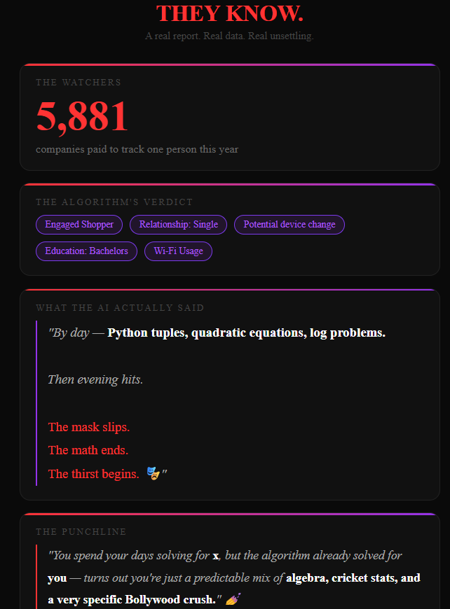

# 🔴 Privacy Wrapped
### *Spotify Wrapped, but make it terrifying.*

> "You spend your days solving for x, but the algorithm already solved for **you**."

Privacy Wrapped is an open-source tool that takes your Instagram and Google data exports and generates a personalized, slightly savage AI report showing exactly what these platforms know about you.

**No server. No upload. Your data never leaves your machine.**
---
## 🔥 Live Demo

> Here's a real (slightly censored) report generated from actual Instagram + Google data:
> 



---
### 👁️ PRIVACY WRAPPED: THE SEMI-SENTIENT EDITION

**📊 THE NUMBERS**
There are **5,881 companies** currently living inside your pocket. That is more than the entire student body of a major college — watching you brush your teeth. You can't even decide on a data plan without thousands of CEOs getting a notification about it. 🐜

**🧠 YOUR ALGORITHM PERSONALITY**
By day: a high-functioning logic machine sweating over Python tuples and complex algebraic expressions.
By night: the mask slips. The math stops. The thirst begins. 🎭

Instagram has you filed under:
- ✅ Engaged Shopper
- ✅ Relationship Status: Single
- ✅ Education: Associate/Bachelors Degree
- ✅ Potential mobile network change (they know before your bank does)

**🫧 THE INVISIBLE BUBBLE**
Because you're trapped in the feedback loop the algorithm built for you, here's what you're NOT being shown:
- Original thoughts outside your niche
- Content that might make you question your habits
- Silence. If we let you be bored, you might delete the app. We can't have that.

**🎯 THE PUNCHLINE**
The algorithm already solved for you — and it turns out you're just a predictable mix of algebra, cricket stats, and a very specific Bollywood crush. 💅

---

## ⚡ Get Your Own Report in 5 Steps

### Step 1 — Download Your Instagram Data
👉 [Click here to request your Instagram data](https://accountscenter.instagram.com/info_and_permissions/dyi/)
- Select: **Download to device**
- Format: **HTML** (not JSON)
- Takes: 1–48 hours to arrive in your email

### Step 2 — Download Your Google Data  
👉 [Click here to open Google Takeout](https://takeout.google.com)
- Deselect all → Select only **YouTube** and **My Activity**
- Format: **HTML**
- Takes: Usually under 1 hour

### Step 3 — Setup Environment
```bash
git clone https://github.com/YOUR_USERNAME/privacy-wrapped
cd privacy-wrapped

# Create virtual environment with uv (faster than pip)
uv venv
source .venv/Scripts/activate  # Windows Git Bash
# OR: .venv\Scripts\activate   # Windows CMD

# Install dependencies
uv pip install beautifulsoup4 pandas google-generativeai python-dotenv numpy
```

### Step 4 — Add API Keys
Edit `.env` file:
```
GEMINI_API_KEY=your-key-here
```
Get FREE Gemini key: https://aistudio.google.com/app/apikey

### Step 5 — Run Parsers
```bash
python parsers/instagram_parser.py
python parsers/google_parser.py
python parsers/ai_conversations_parser.py  # Optional: if you have ChatGPT/Claude data
python parsers/feature_engineering.py
python parsers/gemini_embeddings.py
```

---

## 🔬 Surveillance Engine (Advanced Analysis)

After running the basic report, unlock the full ML pipeline to see how platforms monetize your data:

### Installation
```bash
pip install networkx pyvis numpy scikit-learn

# For local embeddings (no API needed)
# Install Ollama: https://ollama.ai
ollama pull nomic-embed-text
```

### Run All Layers

```bash
# Layer 1: Feature Engineering
python parsers/feature_engineering.py

# Layer 2: Embeddings (local, no API needed)
python parsers/gemini_embeddings_ollama.py

# Layer 3: Knowledge Graph
python parsers/knowledge_graph.py
# Opens output/knowledge_graph.html in browser

# Layer 4: RTB Auction Simulator  
python parsers/rtb_simulator.py

# Generate Demo Data (for testing)
python parsers/demo_data_generator.py
```

### Full Dashboard
Open `report/templates/surveillance_dashboard.html` in your browser to see:
- Interactive knowledge graph showing surveillance connections
- Real-time bidding auction simulation
- Your feature vector as a mathematical object
- Behavioral inference timeline

### What Each Layer Does

**Layer 1: Feature Engineering**
- Converts raw data into normalized affinity scores
- Calculates demographic multipliers
- Outputs: `user_feature_matrix.json`

**Layer 2: Embeddings**
- Uses local Ollama (nomic-embed-text) to generate semantic embeddings
- Finds hidden connections between your activities and advertiser interests
- No API calls, runs entirely offline
- Outputs: `embeddings_ollama.json`

**Layer 3: Knowledge Graph**
- Builds interactive network visualization with NetworkX + Pyvis
- Highlights the circular surveillance path in RED:
  - YOU → AI Project → Anxiety Marker → Advertiser → Demographics → YOU
- Shows how your "betterme-ai-interviewer" project revealed job-hunting anxiety
- Outputs: `knowledge_graph.html` (94 nodes, 110 edges)

**Layer 4: RTB Simulator**
- Simulates the 100ms real-time bidding auction
- Uses actual Indian CPM rates (Education: ₹1,205, Entertainment: ₹654)
- Calculates your annual data value based on:
  - 8 sessions/day × 12 ads/session × 365 days
  - Demographic multipliers (single + educated + engaged shopper = 3.28x)
  - Affinity scores (bollywood: 1.0, coding: 0.545)
- Shows winner: typically education companies for job-hunting signals
- Outputs: `rtb_results.json`

### Demo Mode
Try the tool without uploading your own data:
```bash
python parsers/demo_data_generator.py
```
Then open `report/templates/report.html` and click "Try Demo"

---

## 🛠️ How It Works (Surveillance Engine)

```
Layer 0: Data Parsing
Instagram ZIP → BeautifulSoup → instagram_data.json
Google Takeout → Regex Parser → google_data.json
AI Conversations → HTML Parser → ai_data.json

Layer 1: Feature Engineering
All JSON → Affinity Scores → user_feature_matrix.json
(cricket: 0.455, coding: 0.545, bollywood: 1.0)

Layer 2: Embeddings (THE SCARY PART)
All data → Gemini API → embeddings.json
Finds hidden connections:
"betterme-ai-interviewer" ↔ "Scaler Education" (0.891 similarity)
Instagram KNEW you were job hunting before you told anyone

Layer 3: Knowledge Graph (Coming Soon)
Visual network showing surveillance connections

Layer 4: RTB Simulator (Coming Soon)
Simulates real-time bidding auction with Indian CPM rates
```

---

## 📁 Project Structure

```
privacy-wrapped/
├── parsers/
│   ├── instagram_parser.py   # Parses Instagram HTML exports
│   ├── google_parser.py      # Parses Google Takeout data
│   └── combine.py            # Merges data + generates AI report
├── report/
│   └── templates/
│       └── report.html       # Dark UI, drag and drop
├── output/                   # Generated JSON and reports (gitignored)
├── data/                     # Your raw exports (gitignored)
├── .env.example              # Template for API key
├── requirements.txt
└── README.md
```

---

## 🔐 Privacy Note

This tool runs **entirely on your machine**. Your personal data files never leave your computer. The only external call is to OpenRouter's API to generate the report text — and even then, only anonymized insights (not raw data) are sent.

---

## 🧰 Tech Stack

- **Python** + **BeautifulSoup4** — HTML parsing
- **Regex** — Fast line-by-line parsing for large files (50MB+)
- **OpenRouter API** — Free AI report generation
- **python-dotenv** — Secret management
- **Pure HTML/CSS/JS** — Zero framework frontend

---

## 🗺️ Roadmap

- [x] Instagram parser
- [x] Google/YouTube parser
- [x] Industry categorizer (4,295+ advertisers)
- [x] AI report generator
- [x] Dark UI with drag and drop
- [ ] Spotify parser
- [ ] Twitter/X parser
- [ ] Flask web app for non-technical users
- [ ] One-click Vercel deploy
- [ ] Demo mode with sample data

---

## 🤝 Contributing

PRs welcome! Especially for:
- Adding more platform parsers (Spotify, Twitter, LinkedIn)
- Improving advertiser categorization for Indian brands
- UI improvements

---

## ⚠️ Disclaimer

This tool is for educational purposes to raise awareness about data privacy. All data processing happens locally on your machine.

---

*Built in one night out of curiosity and mild existential dread.* 🌙
